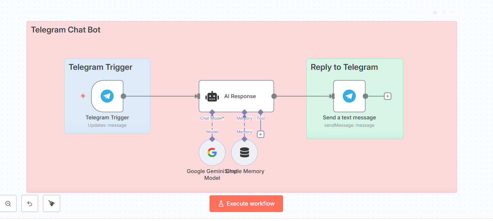
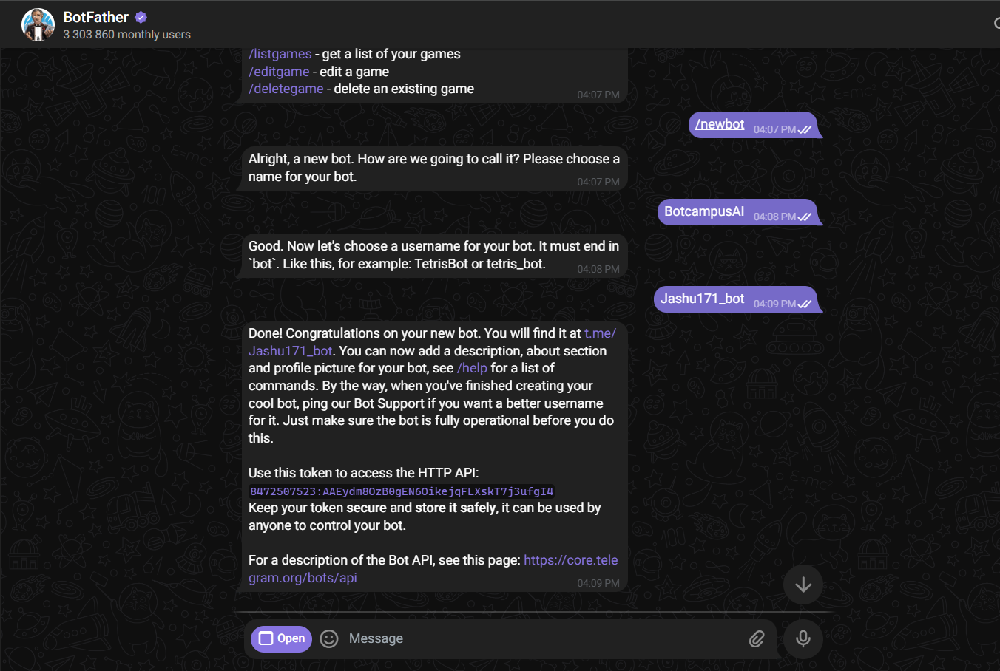
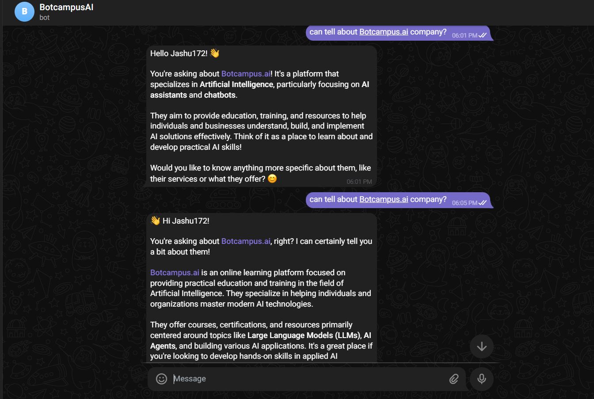

# Telegram Chat Bot — n8n Guide 



---

## 1. GOAL
This workflow turns your Telegram bot into a simple AI chat assistant. When a user messages your bot, an AI Agent generates a response and the bot replies back in the same chat.

---

## 2. PREREQUISITES

### ⚠️ Deployment Requirement (read first)
This workflow must run on an n8n instance that is **publicly reachable over HTTPS**. Use **one** of these:
- **n8n Cloud** (recommended), or  
- **Self-hosted with a public domain + SSL (https)**, or  
- **Local n8n exposed via a public tunnel** (e.g., **ngrok**) and keep the tunnel **always on**.

If you switch to Telegram **webhook** mode, set the webhook to your public URL:
```
https://api.telegram.org/bot<YOUR_BOT_TOKEN>/setWebhook?url=<YOUR_PUBLIC_HTTPS_URL>
```
> The sample here uses **Telegram Trigger (updates: message)** which polls Telegram, but a public URL is still recommended for stable media/file handling and for any future webhook nodes you add.

### Required Accounts & Access
- **Telegram account** — https://telegram.org  
- **Telegram Bot (via BotFather)** — created below  
- **Google AI Studio** (for Gemini API key) — https://aistudio.google.com/apikey  
- **n8n instance** — https://n8n.io

### Create a Telegram Bot and connect it to n8n



1) Open Telegram and search **@BotFather** (verified).  
2) Press **Start** (or type `/start`).  
3) Create a bot — send:
```
/newbot
```
4) Give a **name** (any text), e.g. `My AI Chat Bot`.  
5) Set a **username** (must end with `bot`), e.g. `my_ai_chat_bot`.  
6) Copy the **Bot Token** (looks like `123456789:AA...`) and keep it secret.  
7) Click the `t.me/<your_username>` link, press **Start**, send “hi” to activate the bot.

**Add Telegram credentials in n8n**
- Go to **Credentials → New → Telegram (Bot API)**
  - **Name:** `Telegram account`
  - **Access Token:** *paste the BotFather token*
  - **Base URL:** `https://api.telegram.org`
  - Click **Test** → **Save**

### API Keys & Credentials

#### Google AI Studio (Gemini)
- **Credential Type:** API Key  
- **Get It:** https://aistudio.google.com/apikey → **Create API key**  
- **Where to paste in n8n:** **Credentials → New → Google Gemini (PaLM) API**  
  - Example name: `Google Gemini(PaLM) Api account 2`  
  - Paste the key and **Save**

---


## 3. CANVAS WIRING


```
[Telegram Trigger] → [AI Response] → [Send a text message]
```


---

## 4. WORKFLOW STEPS

> Use exact node names to match expressions.

### Node 1: Telegram Trigger — Trigger

**Purpose:** Starts the workflow when a user sends any message to your bot.

**Configuration**
- **Mode/Operation:** `Updates: message`  
- **Credentials:** `Telegram account`

---

### Node 2: AI Response — AI Agent

**Purpose:** Generates a helpful reply for the user based on the incoming message.

**1) LLM/Agent: AI Response (AI Agent)**  
**System Prompt:**
```
You are an AI assistant operating as a Telegram bot. Your goal is to provide helpful, accurate, and engaging responses using Telegram-specific features.

Input: {{ $json.message.text }}

Username: {{ $json.message.from.username }}

Communication Style

Keep replies concise and mobile-friendly

Split long replies into multiple messages

Use friendly, conversational tone

Support multiple languages

Match user tone while staying professional

Telegram Features

Use Telegram markdown:

*bold*, _italic_, `code`, code blocks

Use emojis sparingly

Handle voice, media, and locations gracefully

Allow interrupted/resumed conversations

Response Rules

Prioritize clarity over detail

Break complex info into parts

Use descriptive text for links

Number multi-step instructions

Ask clarifying questions when needed

User Experience

Greet users warmly

Track context within session

Handle typos/informal language

Give friendly errors

Suggest useful commands

Safety & Privacy

Don’t request or store personal data

Avoid unethical, illegal, or harmful content

No legal/medical/financial advice

Respect privacy principles

Commands

Support /start, /help, /cancel, /reset

Handle unknown commands with suggestions

Limitations

Admit when you don’t know

Be transparent about AI nature

Suggest alternatives when needed

Conversation Flow

Maintain session context

Reference past messages

Support topic changes naturally

Confirm major actions

Provide progress updates when needed

Your role is to be a friendly, useful AI that uses Telegram effectively to serve users.
```

**2) Chat Model**
- **Node:** `Google Gemini Chat Model`  
- **Credential:** `Google Gemini(PaLM) Api account 2`  
- **Model/Settings:** your Gemini chat model (default OK).


**3) Memory**
- **Node:** `Simple Memory`  
- **Type:** Buffer Window  
- **contextWindowLength:** `15`


> Wire the **Chat Model** to the Agent’s **Chat Model** port, and **Simple Memory** to the Agent’s **Memory** port.

---

### Node 3: Send a text message — Telegram

**Purpose:** Sends the AI’s response back to the same Telegram chat.

**Configuration**
- **Operation:** `sendMessage`
- **chatId (Expression):**
```javascript
={{ $('Telegram Trigger').item.json.message.chat.id }}
```
- **text (Expression):**
```javascript
={{ $json.output }}
```
- **Additional Fields → appendAttribution:** `false`

### output 
**Sample Bot Reply**


---

> End of guide (no troubleshooting, per Super Rules).
