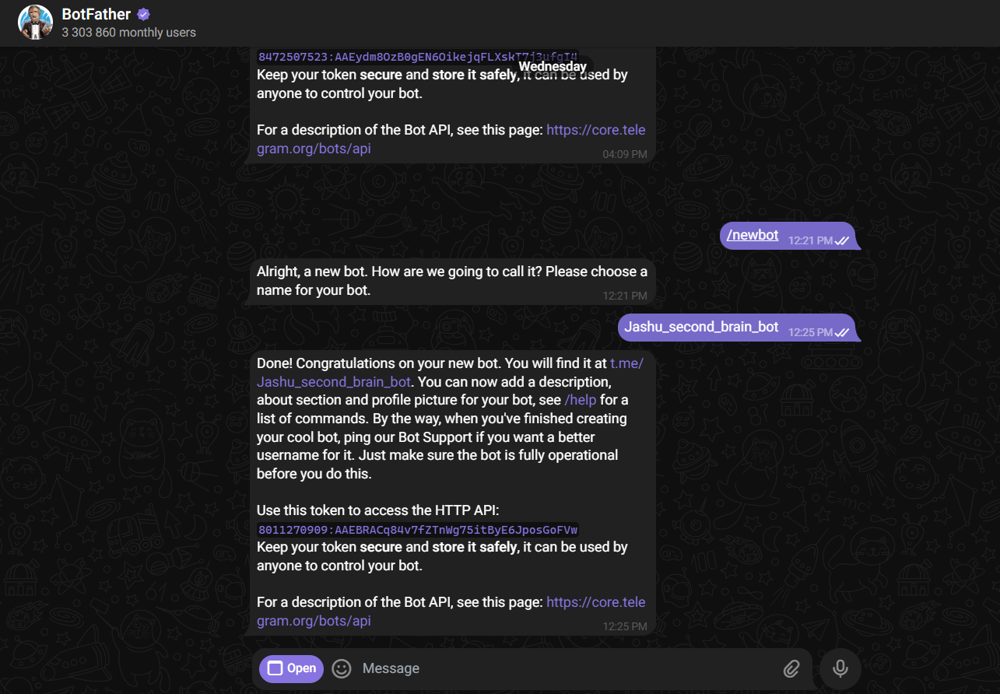
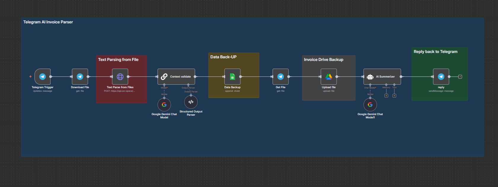
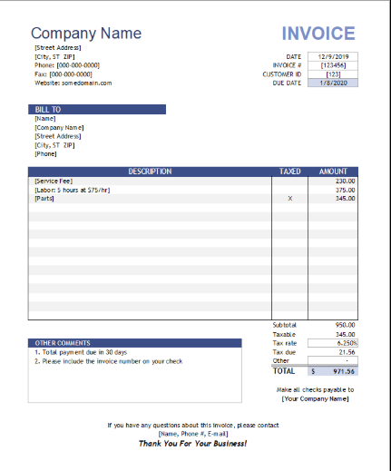
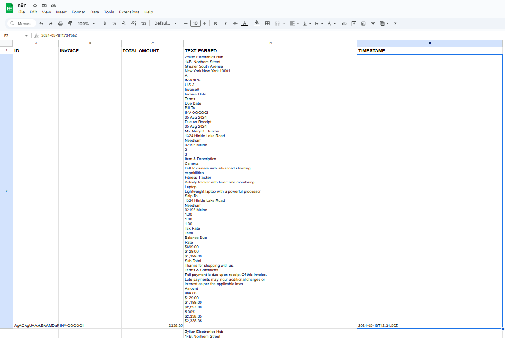
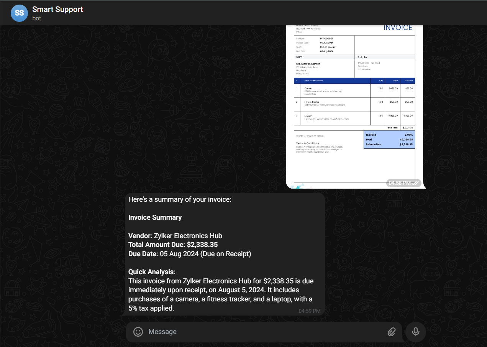

# Telegram AI Invoice Parser — n8n Guide 


---

## 1. GOAL
This workflow takes an **invoice image sent to your Telegram bot**, extracts key fields using OCR + AI, **stores the results in Google Sheets & Google Drive**, and **replies on Telegram** with a short summary.

---

## 2. PREREQUISITES

### Required Accounts & Access
- **Telegram account** — https://telegram.org
- **Google account** (Drive + Sheets) — https://accounts.google.com/signup
- **OCR.space** API key — https://ocr.space/ocrapi
- **Google AI Studio** (Gemini API key) — https://aistudio.google.com/apikey
- **n8n instance** — https://n8n.io

### Create a Telegram Bot and connect it to n8n (step-by-step)



1) **Open Telegram** and search **@BotFather** (verified).  
2) **Start** the chat (press **Start** or type `/start`).  
3) **Create the bot** — send:
```
/newbot
```
4) **Name** your bot (any human-readable name), e.g.:
```
Jashu second brain bot
```
5) **Set a username** (must end with `bot`), e.g.:
```
Jashu_second_brain_bot
```
6) **Copy the Bot Token** BotFather shows (looks like `123456789:AA...`). **Keep it secret.**  
7) **Activate the bot**: click the `t.me/<your_username>` link, press **Start**, send “hi”.

(Optional) If you’ll use groups:
```
/setprivacy
```
Choose your bot → **Disable** (so the bot can read group messages).

#### Add Telegram credentials inside n8n
- Go to **n8n → Credentials → New → Telegram (Bot API)**  
  - **Name:** `Telegram account`  
  - **Access Token:** *paste the BotFather token*  
  - **Base URL:** `https://api.telegram.org`  
  - Click **Test** → **Save**

### API Keys & Credentials (other services)

#### OCR.space
- **Credential Type:** API Key  
- **Get It:** https://ocr.space/ocrapi → sign up → copy **apikey**  
- **Where to paste in n8n:** create an **Environment Variable**
```bash
OCR_SPACE_API_KEY=<your-ocrspace-key>
```
Use it in the HTTP node header:
```
apikey : ={{ $env.OCR_SPACE_API_KEY }}
```

#### Google AI Studio (Gemini)
- **Credential Type:** API Key  
- **Get It:** https://aistudio.google.com/apikey → **Create API key**  
- **Where to paste in n8n:** **Credentials → New → Google Gemini (PaLM) API**  
  Name it `Google Gemini(PaLM) Api account`, paste the key.

#### Google Sheets & Google Drive (OAuth)
- **What is OAuth (simple):** a safe way to let n8n access your Google data without sharing your password.  
- **Connect in n8n:**  
  - **Credentials → New → Google Sheets** (OAuth2) → **Connect** → sign in → **Allow**  
  - **Credentials → New → Google Drive** (OAuth2) → **Connect** → sign in → **Allow**  
- **Scopes:** Sheets `spreadsheets`, Drive `drive.file`  
- **Callback URL format** (if you use your own OAuth app):
```
https://YOUR-N8N-DOMAIN/rest/oauth2-credential/callback
```

---

## 3. CANVAS WIRING
```
[Telegram Trigger] → [Download File] → [Text Parse from Files (HTTP OCR)]
→ [Context validate (LLM Chain)] → [Data Backup (Google Sheets append)]
→ [Get File] → [Upload file (Google Drive)]
→ [AI Summerizer (AI Agent)] → [reply (Telegram sendMessage)]
```

---

## 4. WORKFLOW STEPS

> Keep node names exactly as shown to match expressions.

### Node 1: Telegram Trigger — Trigger
**Purpose:** Start the workflow when a Telegram message (e.g., invoice photo) arrives.

**Configuration**
- **Mode/Operation:** `Updates: message`  
  → Listens for any new message.
- **Credentials:** `Telegram account`

**Sample invoice input**


---

### Node 2: Download File — Telegram - (get file node)
**Purpose:** Fetch the image binary from Telegram using the latest photo size.

**Configuration**
- **Resource:** `file`
- **Operation:** `get`
- **Credentials:** `Telegram account`
- **fileId (Expression):**
```javascript
// Pick the largest available photo size from Telegram's array
={{ $json.message.photo[$json.message.photo.length - 1].file_id }}
```

---

### Node 3: Text Parse from Files — HTTP Request (OCR.space)
**Purpose:** Send the image to OCR.space and receive extracted text.

**Configuration**
- **Method:** `POST`
- **URL:** `https://api.ocr.space/parse/image`
- **Send Headers:** `true`
- **Header:**
```
apikey : ={{ $env.OCR_SPACE_API_KEY }}
```
- **Send Body:** `true`
- **Content-Type:** `multipart-form-data`
- **Body Parameters:**
  - **formBinaryData**
    - **name:** `Image`
    - **inputDataFieldName:** `data`   // sends the binary from Node 2
  - **field**
    - **name:** `language`
    - **value:** `eng`


---

### Node 4: Context validate — LLM Chain
**Purpose:** Convert raw OCR output into clean, structured JSON fields.

**LLM Chain**
- **Prompt Type:** `Define`
- **Text (Input to LLM):**
```javascript
// Pass the OCR payload to the chain
={{ $json.ParsedResults }}
```

**Chat Model**
- **Model Node:** `Google Gemini Chat Model` (credential: `Google Gemini(PaLM) Api account`)
- **Settings:**
  - Model: `gemini-1.5-pro`
  - Temperature: `0.1`
  - Max Tokens: `512`

**Tools**
- *(none)*

**Memory**
- *(none)*

**Structured Output Parser**
- **Parser Node:** `Structured Output Parser` (see Node 5 for schema)

**System Prompt**
```
You are a precise extractor. From the provided invoice OCR JSON (fields may include rawText, invoiceNumber, totals),
return ONE JSON object with EXACTLY these keys:

{
  "Invoice Number": "<string>",
  "Total Amount": "<number>",
  "Raw OCR text": "<string>",
  "Timestamp": "<ISO-8601 UTC>"
}

Rules:
- "Invoice Number": use invoiceNumber if present; else infer from raw text (Invoice No/Number/#/Inv#).
- "Total Amount": prefer totals.total; else find the numeric near “Grand Total”, “Total Amount”, “Amount Due”.
- "Raw OCR text": copy full raw text.
- "Timestamp": current UTC ISO-8601 (e.g., 2025-10-16T09:41:00Z).
- Output JSON only. No markdown, no extra keys.
```

**Expected result**
```json
{
  "output": {
    "Invoice Number": "INV-001",
    "Total Amount": 123.45,
    "Raw OCR text": "...",
    "Timestamp": "2025-10-16T09:41:00Z"
  }
}
```

---

### Node 5: Structured Output Parser — Parser
**Purpose:** Enforce strict JSON shape for the extractor.

**Schema**
```json
{
  "Invoice Number": "string - the invoice id or 'N/A'",
  "Total Amount": "number - numeric total without currency symbol",
  "Raw OCR text": "string - full OCR text",
  "Timestamp": "string - ISO-8601 UTC time e.g., 2025-10-16T09:41:00Z"
}
```

---

### Node 6: Data Backup — Google Sheets (append)
**Purpose:** Append each parsed invoice to a Google Sheet.

**Configuration**
- **Operation:** `append`
- **Document:** select your spreadsheet (e.g., `n8n`)
- **Sheet Name:** `Invoice`
- **Credentials:** Google Sheets (OAuth)
- **Columns Mapping:**
```json
{
  "ID": "={{ $('Download File').item.json.result.file_id }}",
  "INVOICE": "={{ $json.output['Invoice Number'] }}",
  "TOTAL AMOUNT": "={{ $json.output['Total Amount'] }}",
  "TEXT PARSED": "={{ $json.output['Raw OCR text'] }}",
  "TIMESTAMP": "={{ $json.output.Timestamp }}"
}
```

**Example output in Google Sheet**


---

### Node 7: Get File — Telegram
**Purpose:** Retrieve the same file again to upload to Drive.

**Configuration**
- **Resource:** `file`
- **Operation:** `get`
- **Credentials:** `Telegram account`
- **fileId (Expression):**
```javascript
={{ $('Download File').item.json.result.file_id }}
```

---

### Node 8: Upload file — Google Drive
**Purpose:** Store the original invoice image in Drive.

**Configuration**
- **Operation:** `upload`
- **Destination Folder:** choose a folder (e.g., `N8N Invoices`)
- **Simplify Output:** `OFF`
- **Credentials:** Google Drive (OAuth)

---

### Node 9: AI Summerizer — AI Agent
**Purpose:** Create a concise Telegram-ready summary from the parsed text.

**AI Agent**
- **Text (Input):**
```javascript
={{ $('Context validate').item.json.output['Raw OCR text'] }}
```

**Chat Model**
- **Model Node:** `Google Gemini Chat Model1` (credential: `Google Gemini(PaLM) Api account`)
- **Settings:**
  - Model: `gemini-1.5-pro`
  - Temperature: `0.2`
  - Max Tokens: `256`


**System Prompt**
```
Summarize this invoice in 3–5 short lines for a Telegram message:
- Vendor (if found)
- Invoice number
- Total amount (numeric)
- Due date (if present)
- One-sentence note (e.g., overdue/amount due)

Keep it concise and factual. No JSON. No extra chatter.
```

**Example Telegram reply**


---

### Node 10: reply — Telegram (sendMessage)
**Purpose:** Send the AI summary back to the same user.

**Configuration**
- **Operation:** `sendMessage`
- **chatId (Expression):**
```javascript
={{ $('Telegram Trigger').item.json.message.from.id }}
```
- **text (Expression):**
```javascript
={{ $json.output }}
```
- **Append Attribution:** `false`

---

> **End of Guide — exact structure applied; no troubleshooting section.**
