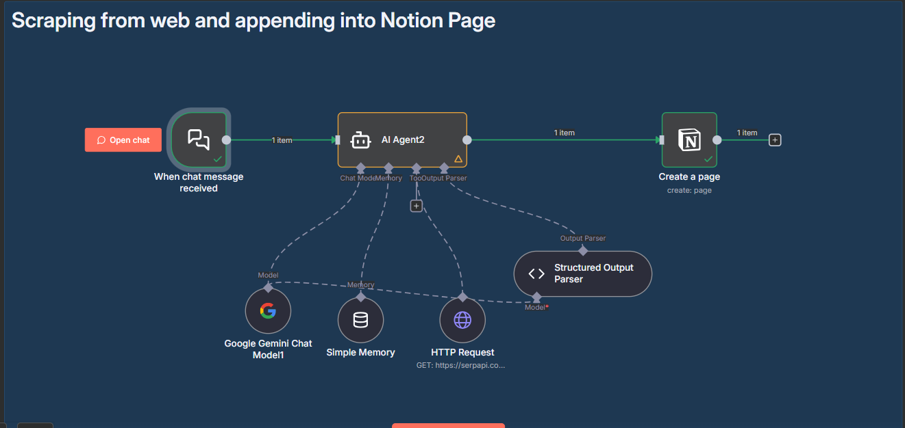

# Scraping from Web and Appending into Notion Page (n8n)



> This guide documents an n8n workflow that takes a chat request, researches the web with SerpAPI via an AI Agent (Gemini), structures the findings, and writes them into a Notion page as a new page with formatted content.

---

## 1. GOAL

This workflow lets a non‑technical teammate ask a research question in chat and automatically creates a clean Notion page containing the heading, summary, and key points of the findings.

---

## 2. PREREQUISITES

### Required Accounts & Access
- **n8n** (Cloud or self‑hosted) — <https://n8n.io>
- **Notion** — <https://www.notion.so>
- **SerpAPI** (Google Search API) — <https://serpapi.com/>
- **Google AI Studio (Gemini API key)** — <https://aistudio.google.com/>

### API Keys & Credentials

| Service | Credential Type | How to Get | Where to Paste in n8n | Notes |
|---|---|---|---|---|
| Notion | Internal Integration Secret | Notion → Settings → **My connections** → **Develop or manage integrations** → **New integration** → Copy **Internal Integration Secret** | **Credentials** → **Notion API** | Share your Notion **page/database** with this integration (… menu → **Add connections**) |
| SerpAPI | API Key | SerpAPI → Dashboard → **API Key** | Use in **HTTP Request Tool** parameters (recommended via env var) | Avoid hard‑coding keys. Use `{{$env.SERP_API_KEY}}` |
| Google Gemini | API Key | Google AI Studio → **Get API key** | **Credentials** → **Google Palm API** (used by “Google Gemini Chat Model1”) | Ensure project has access to the chosen Gemini model |

#### OAuth Credentials (if ever needed)
OAuth is a way for apps to connect to your account without sharing your password. If you use OAuth in other flows, n8n’s callback format is:  
`https://<your-n8n-host>/rest/oauth2-credential/callback`

> This specific workflow uses **API keys** (Notion integration token, SerpAPI key, Gemini key).

---

## 3. CANVAS WIRING

**Main path:**  
`[When chat message received] → [AI Agent2] → [Create a page]`

**Agent wiring:**  
- `Google Gemini Chat Model1` → (Language Model) → `AI Agent2` and `Structured Output Parser`  
- `HTTP Request` (SerpAPI) → (Tool) → `AI Agent2`  
- `Simple Memory` → (Memory) → `AI Agent2`  
- `Structured Output Parser` → (Output Parser) → `AI Agent2`

---

## 4. WORKFLOW STEPS

### Node 1: When chat message received — *Chat Trigger*
**Purpose**: Starts the workflow when a new chat message arrives in n8n’s built‑in chat.

**Configuration**
- **Mode/Operation**: *Default*  
  → Listens for chat input and exposes it as `{{$json.chatInput}}`.
- **WebhookId**: Auto‑generated on create  
  → n8n provides a URL to open the chat UI.

**Drag & Drop Guide**
1. In the left panel, search **“Chat Trigger”**.
2. Drag **When chat message received** onto canvas.
3. No additional fields required for a basic test.

---

### Node 2: AI Agent2 — *AI Agent (LangChain)*
**Purpose**: Reads the user question, calls SerpAPI via tool, formats results using the Structured Output Parser, and returns structured JSON for Notion.

**Configuration**
- **Prompt Type**: `define`  
  → Uses a fixed system prompt with your chat input as the user message.
- **Text**:  
  ```javascript
  {{$json.chatInput}}
  ```
  → Passes the chat message into the agent.
- **Has Output Parser**: `true`  
  → Ensures the model outputs JSON matching the schema below.
- **System Message (System Prompt)**:  
  ```text
  # AI Research Agent System Prompt

  You are a research and documentation agent that searches topics and saves findings to Notion pages.

  ## Workflow

  1. Search from the serpAPI
  2. Structure the data into Tittle,summary,points,urls,etcc

  Output:
  {

     "Heading" : "string",
      "summary" : "string",
    "key_points" : "string"

  }
  ```

**Chat Model Settings**
- **Language Model**: from node **Google Gemini Chat Model1**  
- **Temperature**: start with `0.2` (more factual)  
- **Max Tokens**: leave as default or set to cover your expected output

**Structured Output (Schema)**
```json
{
  "Heading": "string - title for the Notion page",
  "summary": "string - concise overview of the findings",
  "key_points": "string - bullet-style lines or numbered points"
}
```

**Drag & Drop Guide**
1. Search **“AI Agent”** and drop **AI Agent2**.
2. Connect **When chat message received → AI Agent2**.
3. Wire **Google Gemini Chat Model1** to the agent’s **Language Model** port.
4. Wire **HTTP Request** to the agent’s **Tool** port.
5. Wire **Simple Memory** to the agent’s **Memory** port.
6. Wire **Structured Output Parser** to the agent’s **Output Parser** port.

---

### Node 3: Google Gemini Chat Model1 — *Language Model*
**Purpose**: Provides the LLM (Gemini) that powers the agent’s reasoning.

**Configuration**
- **Credential**: *Google Palm API* → your Gemini API key
- **Model**: pick a Gemini chat model suitable for web research (e.g., `gemini-2.0-flash` or equivalent)

**Drag & Drop Guide**
1. Search **“Google Gemini Chat”** and drop it.
2. Open **Credentials** and select your Google Palm/Gemini key.
3. Connect its output to **AI Agent2 (Language Model)** and to **Structured Output Parser (Model)**.

---

### Node 4: Simple Memory — *Buffer Window Memory*
**Purpose**: Gives the agent short conversation memory to keep context across turns.

**Configuration**
- **Context Window Length**: `50`  
  → Number of messages to remember (tune as needed).

**Drag & Drop Guide**
1. Search **“Memory (Buffer Window)”**.
2. Drop **Simple Memory** and connect it to **AI Agent2 (Memory)**.

---

### Node 5: HTTP Request — *Tool: SerpAPI Google Search*
**Purpose**: Lets the agent perform web search via SerpAPI.

**Configuration**
- **URL**: `https://serpapi.com/search`
- **Send Query**: `true`
- **Query Parameters**  
  - `engine`: `google`  
    → Use Google search.
  - `q`:  
    ```javascript
    {{$fromAI('query', 'The search query based on the topic the user wants to research', 'string')}}
    ```
    → The agent provides a concrete search query string at runtime.
  - `api_key`:  
    ```javascript
    {{$env.SERP_API_KEY}}
    ```
    → **Recommended**: store your SerpAPI key in an environment variable.
  - `hl`: `en`  
  - `num`: `10`

> ⚠ If you must mirror the original flow exactly, you can hard‑code the key in **Query Parameters → api_key**, but this is not recommended. Use env vars instead.

**Drag & Drop Guide**
1. Search **“HTTP Request Tool”** (LangChain tool version) and drop it.
2. Fill the fields above.
3. Connect to **AI Agent2 (Tool)** port.

---

### Node 6: Structured Output Parser — *JSON Output Parser*
**Purpose**: Forces the model to return JSON conforming to the schema so the Notion step can map fields safely.

**Configuration**
- **JSON Schema Example**  
  ```json
  {
    "Heading": "string",
    "summary": "string",
    "key_points": "string"
  }
  ```
- **Auto Fix**: `true`  
  → Attempts to coerce slightly off‑schema outputs into valid JSON.

**Drag & Drop Guide**
1. Search **“Structured Output Parser”** and drop it.
2. Paste the JSON schema above.
3. Connect to **AI Agent2 (Output Parser)**.
4. Also wire **Google Gemini Chat Model1** as the **Model** for this parser.

---

### Node 7: Create a page — *Notion*
**Purpose**: Creates a Notion page and writes the AI output into blocks.

**Configuration**
- **Resource**: `Page`
- **Operation**: `Create`
- **Page ID (Mode: URL)**: paste your Notion page/database URL (e.g., `https://www.notion.so/<...>`)  
  → n8n resolves it to the internal page ID.
- **Title**:  
  ```javascript
  {{$json.output.Heading}}
  ```
- **Block UI → Blocks**  
  1) **heading_1** → **Text Content**:  
     ```javascript
     {{$json.output.Heading}}
     ```
  2) **paragraph** (default) → **Text Content**:  
     ```javascript
     {{$json.output.summary}}

     {{$json.output.key_points}}
     ```
- **Credentials**: select your **Notion API** credential (integration token).

**Drag & Drop Guide**
1. Search **“Notion”** and drop **Create a page**.
2. Choose **Page → Create**.
3. Paste your **Page ID (URL mode)** and map **Title** and **Blocks** as above.
4. Connect **AI Agent2 → Create a page** on the main line.

---

## 5. TROUBLESHOOTING

### Error: `invalid_api_key` (SerpAPI)
**Why This Happens**: Wrong or missing SerpAPI key.  
**How to Fix**
1. Set `SERP_API_KEY` in your n8n environment.
2. In the HTTP Request tool, use `{{$env.SERP_API_KEY}}` for `api_key`.
3. Run the node alone to verify you receive JSON results.

### Error: `NotionAPIError` / page not found
**Why This Happens**: The integration isn’t connected to the target page or URL is incorrect.  
**How to Fix**
1. In Notion, open the page/database → **…** → **Add connections** → add your integration.
2. Use the **page/database URL** in **Page ID (URL mode)**.
3. Test the node; a new page should appear in Notion.

### Workflow not triggering
- **Check** the Chat Trigger is enabled (green check) and you’re using the correct chat UI link.
- **Verify** executions in **Executions** view for errors.
- **Test** by sending a short prompt like “Research Python basics”.

### Data not flowing correctly
- **Inspect** `AI Agent2` output in the execution data; confirm it has `output.Heading`, `output.summary`, `output.key_points`.
- **Common Issue**: Model returns non‑JSON text.  
- **Solution**: Keep **Structured Output Parser → Auto Fix = true** and simplify the system prompt.

---

### Test Run (Quick)
1. Open the chat (Chat Trigger) and send: “Research n8n basics.”
2. Confirm the agent runs SerpAPI and returns structured JSON.
3. Check Notion for a new page titled “n8n basics” with summary and points.

---

**Notes**  
- Keep secrets in environment variables.  
- Update schema/blocks if you add more fields like `urls` or `sources`.

