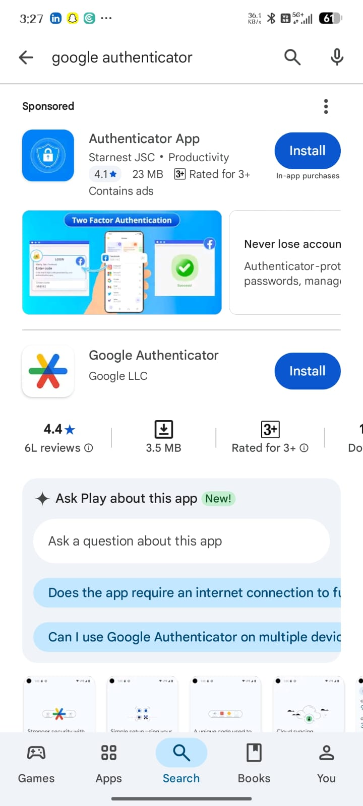
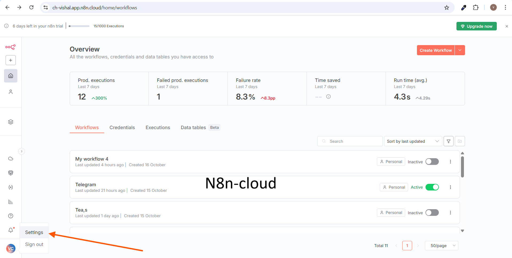
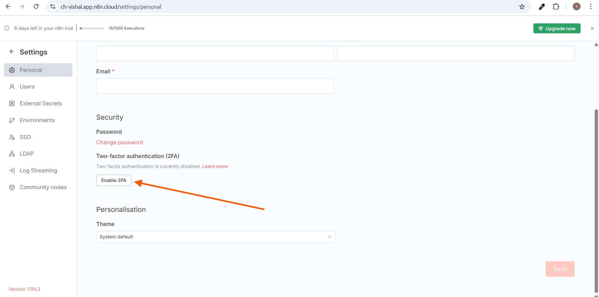
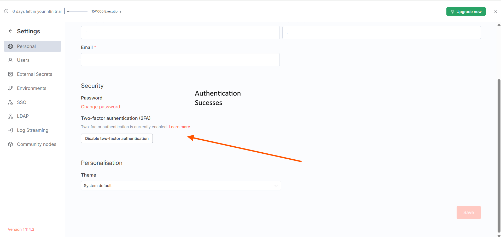

# Enable Two-Factor Authentication (2FA) with Google Authenticator for n8n

Follow each step to enable Time‑based One‑Time Password (TOTP) 2FA for your n8n account using the Google Authenticator app.

---

## What you will set up
- **Operation:** Enable Two‑Factor Authentication (2FA)
- **Mode:** TOTP (Time‑based One‑Time Password) via Google Authenticator

---

## Prerequisites
1. An active n8n account (Cloud or self‑hosted with UI access).
2. A smartphone that can install Google Authenticator.
3. Stable internet connection during setup.

**App download links**  
- Android (Play Store): https://play.google.com/store/apps/details?id=com.google.android.apps.authenticator2  
- iOS (App Store): https://apps.apple.com/in/app/google-authenticator/id388497605

---

## Step 1 — Install Google Authenticator
1. Open your phone’s app store and install **Google Authenticator**.  
   

---

## Step 2 — Open n8n Settings
1. Sign in to your n8n workspace.
2. From the left sidebar, open your profile menu and click **Settings**.  
   

---

## Step 3 — Go to Security and Enable 2FA
1. In Settings, choose **Personal**.
2. In the **Security** section, find **Two‑factor authentication (2FA)**.
3. Click **Enable 2FA**.  
   

---

## Step 4 — Pair Google Authenticator
1. n8n shows a **QR code** and a **secret key**.
2. On your phone, open **Google Authenticator**.
3. Tap the **+** button, then select **Scan a QR code** (recommended) or **Enter a setup key**.
4. After adding, the app will show a **6‑digit code** that refreshes roughly every 30 seconds.

---

## Step 5 — Verify and Finish
1. In n8n, enter the current **6‑digit code** from Google Authenticator.
2. Submit to confirm. 2FA will show as **enabled**.  
   

---

## How sign‑in works after enabling 2FA
1. Enter your n8n email and password.
2. When prompted, open Google Authenticator and type the current **6‑digit code**.

---

## Disable 2FA (if needed)
- Go to **Settings → Personal → Security**.
- Click **Disable two‑factor authentication** and confirm.

---

## Backup and recovery recommendations
- If n8n provides **backup codes**, save them in a secure password manager.
- Consider adding a **second authenticator** on another device using the same QR/secret during setup, or enable your password manager’s TOTP as a fallback.
- If you lose your phone and have no backups, contact your workspace owner/admin to recover access.

---

## Common issues and fixes
1. **Code always invalid**: Ensure your phone’s time is set to automatic and accurate. Use the newest code before it refreshes.
2. **Can’t scan QR**: Use **Enter a setup key** and manually type the secret key from n8n.
3. **New phone migration**: In Google Authenticator use **Transfer accounts** to export/import, or in n8n disable 2FA, then enable again and pair your new device.

---

