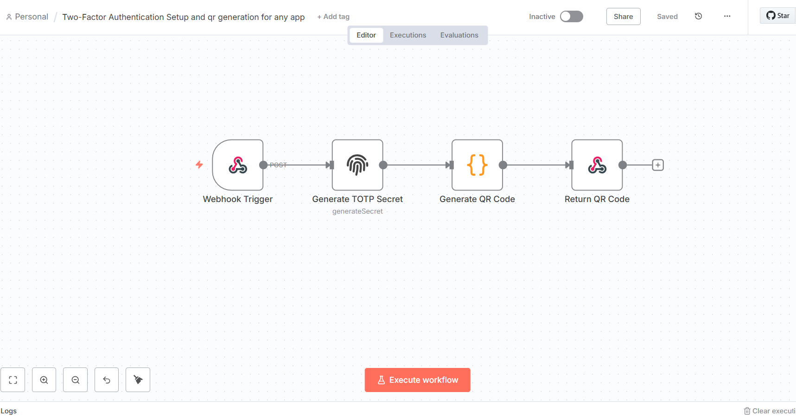
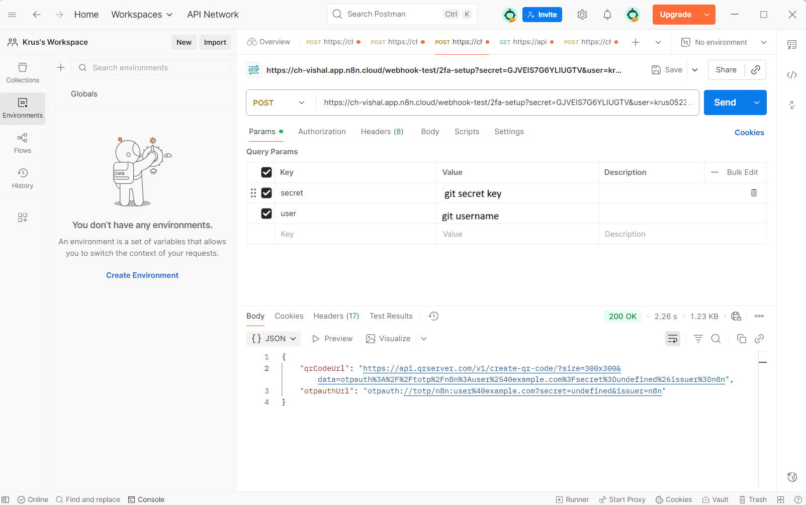
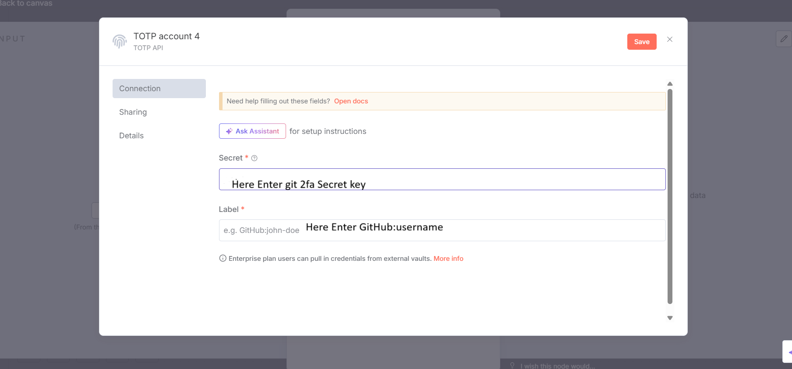
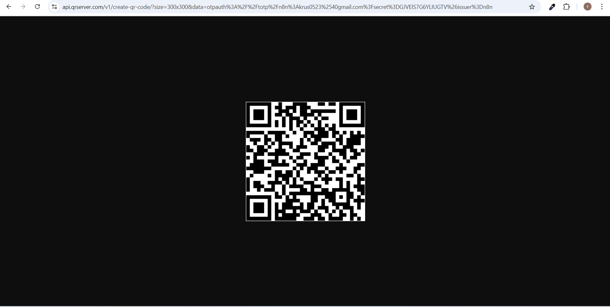
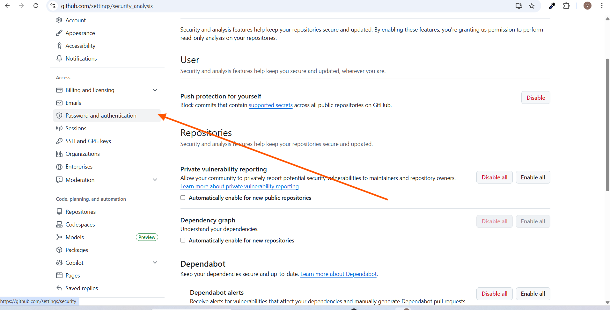
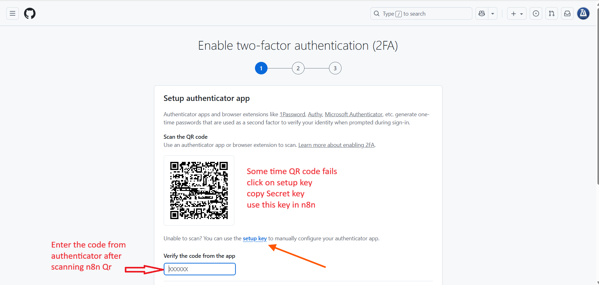

# n8n — Two-Factor Authentication (TOTP) Secret + QR Generator (Any App)

A complete step-by-step guide to generate a **TOTP secret** and a **QR code** (otpauth URI) in n8n, so you can enable app-based 2FA (Google Authenticator, 1Password, Authy, Microsoft Authenticator, etc.) for services like **GitHub**, **GitLab**, **Bitwarden**, **Cloudflare**, and more.

---

## 1) Goal

- Accept a user and secret via webhook (or auto-generate a secret).
- Build a valid `otpauth://` URL and turn it into a QR code.
- Return the QR image URL and the raw otpauth URL to the caller.
- Use the same flow to scan in your target app (example: GitHub).

---

## 2) Prerequisites

### Accounts & Access
- An **n8n** instance (local, VM, or cloud). n8n v1.70+ recommended.
- A service where you want to enable **TOTP 2FA** (example: **GitHub**).
- An **Authenticator app**: Google Authenticator / 1Password / Authy / Microsoft Authenticator.

### Tools (optional but useful)
- **Postman** (or **curl**) to test the webhook.
- A web browser to open the QR image URL.

### Environment (recommended)
If you prefer not to send the secret in requests, you can pass it via environment vars:
```bash
TOTP_SECRET=YOUR_BASE32_SECRET
TOTP_ISSUER=n8n
```
You can also pass `secret` and `user` in the request (shown later).

---

## 3) Architecture Snapshot



**Nodes (left → right):**
1. **Webhook Trigger** — receives `secret` and `user` (or generates secret).
2. **Generate TOTP Secret** — creates/validates a Base32 TOTP secret.
3. **Generate QR Code** — builds `otpauth://...` and QR code URL.
4. **Return QR Code** — responds with JSON (`qrCodeUrl` + `otpauthUrl`).

---

## 4) Canvas Wiring (Drag & Drop)

1. Drag **Webhook** (Trigger) to the canvas → connect to **Generate TOTP Secret**.
2. Drag **totp** (node) → rename to **Generate TOTP Secret**.
3. Drag **Function** (Code) → rename to **Generate QR Code**.
4. Drag **Webhook** (Response) → rename to **Return QR Code**.
5. Wire: `Webhook → Generate TOTP Secret → Generate QR Code → Return QR Code`.

---

## 5) Node-by-Node Setup

### A. Webhook (Trigger)
**Operation / Mode:** Trigger → Use **Production URL** when testing from outside

- **HTTP Method:** `POST`
- **Path:** `2fa-setup` (any safe path)
- **Respond:** Leave default (final response is sent by last Webhook node)

Accepts **query params** or **JSON body**:

- `secret` — Base32 TOTP secret (if omitted, the flow generates one)
- `user` — Label for authenticator (e.g., email or username)

**Example (query params):**
```
POST {{WEBHOOK_PROD_URL}}?secret=JBSWY3DPEHPK3PXP&user=john@example.com
```

Screenshot:  


---

### B. Generate TOTP Secret (node)
**Operation / Mode:** Function → Run Once for Each Item


Reference credential UI:  


---

### C. Generate QR Code (Function)
**Operation / Mode:** Function → Run Once for Each Item

```javascript
const secret = $('Webhook Trigger').first().json.query.secret;
const issuer = 'n8n';
const accountName = $('Webhook Trigger').first().json.query.user || 'user@example.com';
const otpauthUrl = `otpauth://totp/${encodeURIComponent(issuer)}:${encodeURIComponent(accountName)}?secret=${secret}&issuer=${encodeURIComponent(issuer)}`;
const qrCodeUrl = `https://api.qrserver.com/v1/create-qr-code/?size=300x300&data=${encodeURIComponent(otpauthUrl)}`;
return [{ json: { secret, qrCodeUrl, otpauthUrl } }];
```

Preview:  


---

### D. Return QR Code (Webhook Response)
**Operation / Mode:** Respond to Webhook

- **Response Code:** `200`
- **Response Body:** JSON from previous node

**Response Body (Expression):**
```json
={{ $json }}
```

**Expected response:**
```json
{
  "qrCodeUrl": "https://api.qrserver.com/v1/create-qr-code/?size=300x300&data=otpauth%3A...",
  "otpauthUrl": "otpauth://totp/n8n:user%40example.com?secret=JBSWY3DPEHPK3PXP&issuer=n8n",
  "secret": "JBSWY3DPEHPK3PXP",
  "user": "user@example.com",
  "issuer": "n8n"
}
```

---

## 6) Test the Flow (Postman / curl)

**Postman (query params)**
```
POST {{WEBHOOK_PROD_URL}}?secret=JBSWY3DPEHPK3PXP&user=john@example.com
```

**curl (query params)**
```bash
curl -X POST "{{WEBHOOK_PROD_URL}}?secret=JBSWY3DPEHPK3PXP&user=john@example.com"
```

**curl (JSON body)**
```bash
curl -X POST "{{WEBHOOK_PROD_URL}}" \
  -H "Content-Type: application/json" \
  -d '{"secret":"JBSWY3DPEHPK3PXP","user":"john@example.com"}'
```

Open the returned `qrCodeUrl` in a browser to scan.

---

## 7) Enable 2FA in Your Target App (Example: GitHub)

1. Go to **Settings → Password and authentication**.  

2. Click **Enable two-factor authentication** and choose **Authenticator app**.
3. If the site shows its own QR, click **“setup key”** and use this flow to build a fresh QR from that key.
4. Scan the **QR** built by n8n (or enter the secret manually) and verify.  


---

## 8) Troubleshooting

- **Undefined secret in response** → Pass `secret` (query/body) or let the code generate one.
- **Authenticator says “invalid format”** → Secret must be Base32 (A–Z, 2–7). No spaces.
- **Codes don’t verify** → Ensure your device time is correct (TOTP is time-based).
- **Cannot hit webhook** → Use **Production URL** for external requests.

---

