# n8n → Elasticsearch (Elastic Cloud) Logging — Step-by-Step Guide (with Screenshots)

This guide is beginner-friendly and matches your requested flow. It includes **clear node instructions**, **operation/mode**, **drag-and-drop guidance**, and **copyable blocks**. Screenshots are embedded with relative paths so the README renders anywhere.

---
Overall pipeline on canvas:  
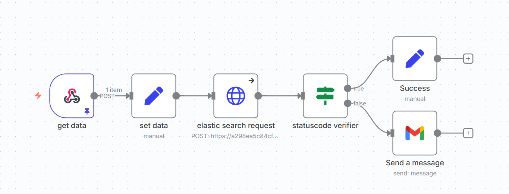

## A) Elastic Cloud Setup

1. **Start Free Trial → Sign in**
   - Go to Elastic and click **Start free trial**.
   - Complete the short **Sign up** form.
   - **Images:**  
     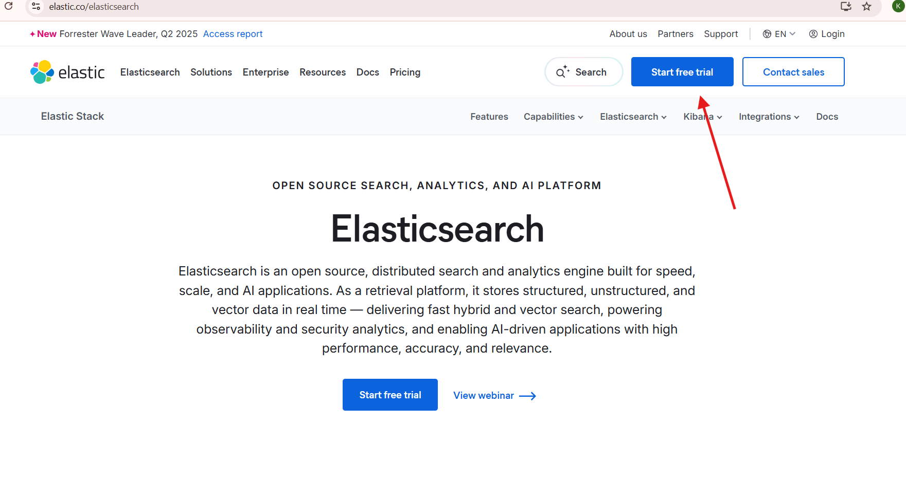  
     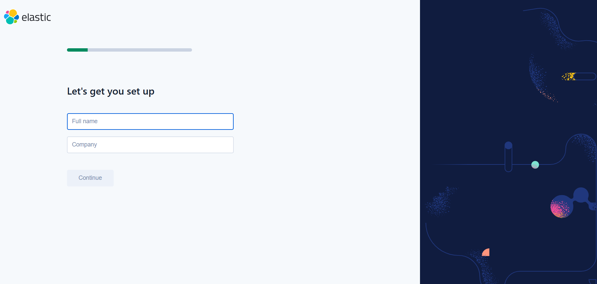

2. **Choose Deployment Type**
   - Select **Elastic Cloud Hosted** (recommended) or **Serverless**.  
   - 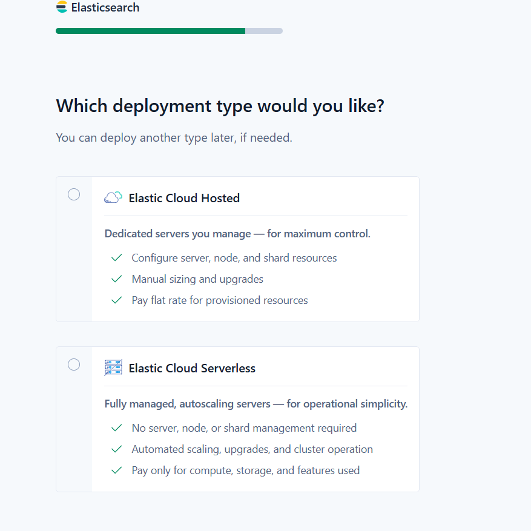

3. **Pick Region & Launch**
   - Choose a region near you and click **Launch**. Wait until status is **Healthy**.  
   - 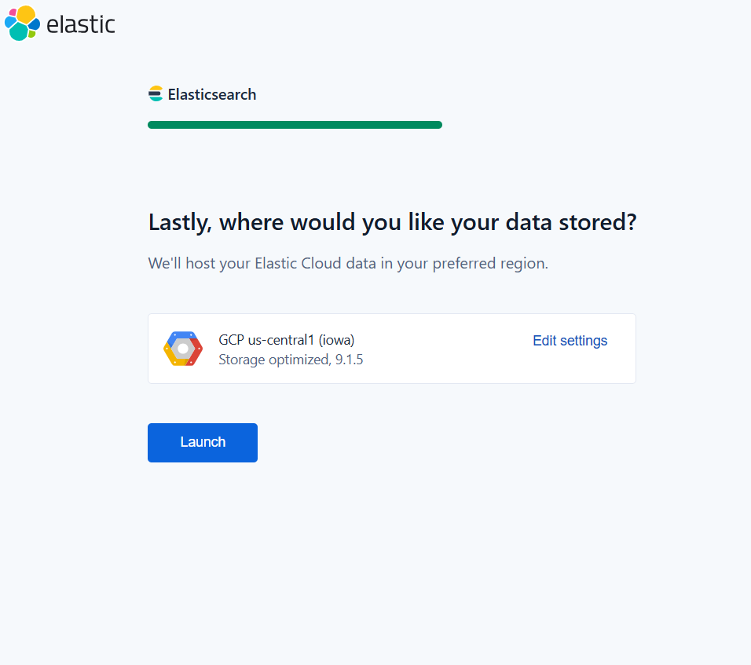

4. **Open Deployment → Copy Elasticsearch Endpoint**
   - In the top nav, open the deployment menu → **Manage this deployment**.
   - On the deployment page, click **Copy endpoint** under **Elasticsearch**.
   - **Images:**  
     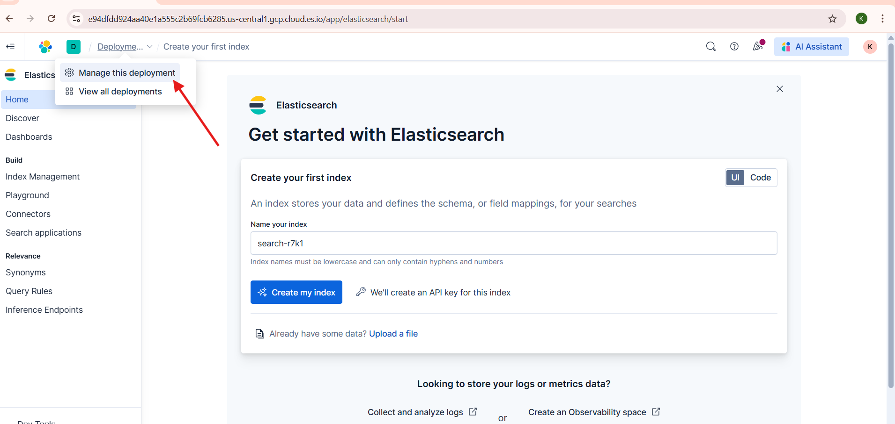  
     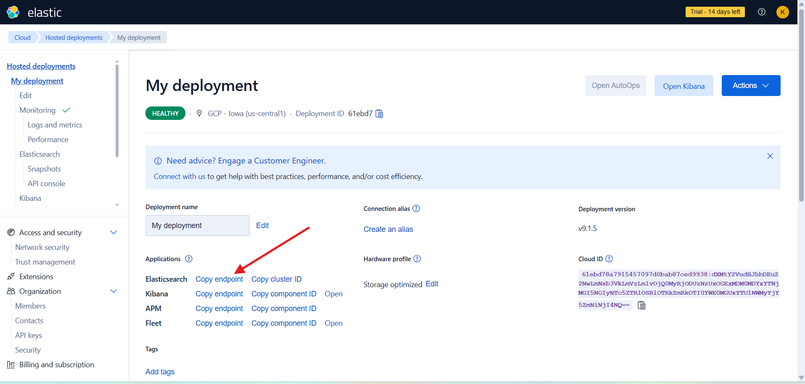

5. **Open Kibana → Create API Key**
   - On the deployment page, click **Open Kibana**.  
     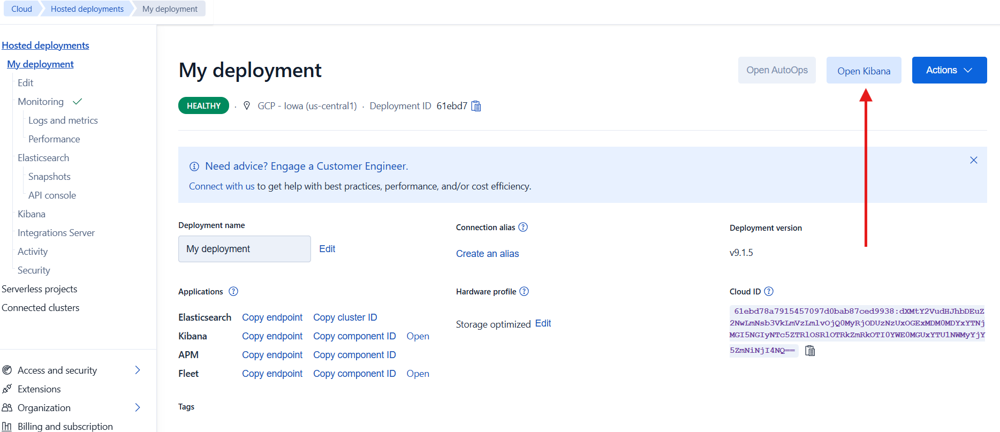
   - In Kibana go to **Management → Stack Management**.  
     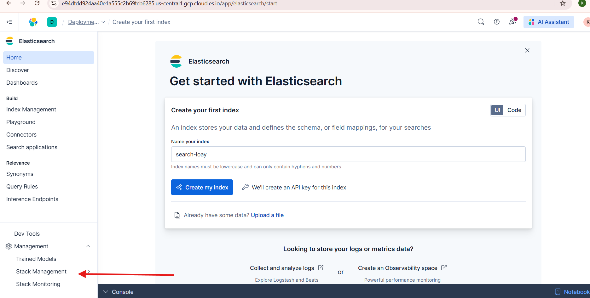
   - Then **Security → API keys** and click **Create API key**. Name it `n8n`.  
     
   - Copy the **Encoded** API key value (Base64 form of `id:key`) — this is what you paste into n8n headers.  
     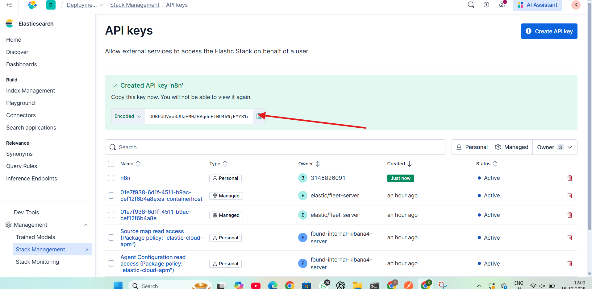

> You won’t see the encoded key again later. Store it securely.

---

## B) Build the n8n Workflow

Overall pipeline on canvas:  


### 1) **Webhook** — *get data*
- **Drag & Drop:** Webhook node
- **Operation / Mode:** `POST`
- **Path:** `log-event`

**Settings (copy):**
```text
HTTP Method: POST
Path: log-event
```
**What it looks like:**  
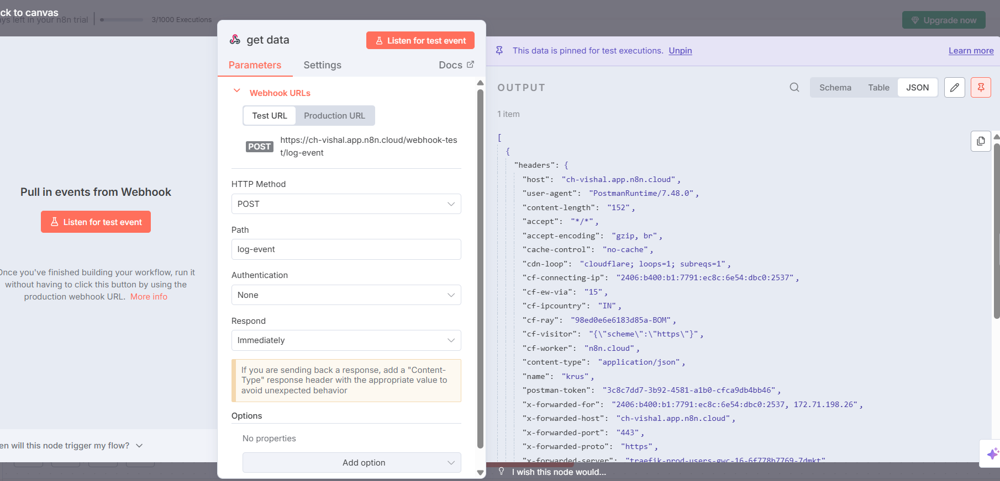

**Test (Postman example):**  
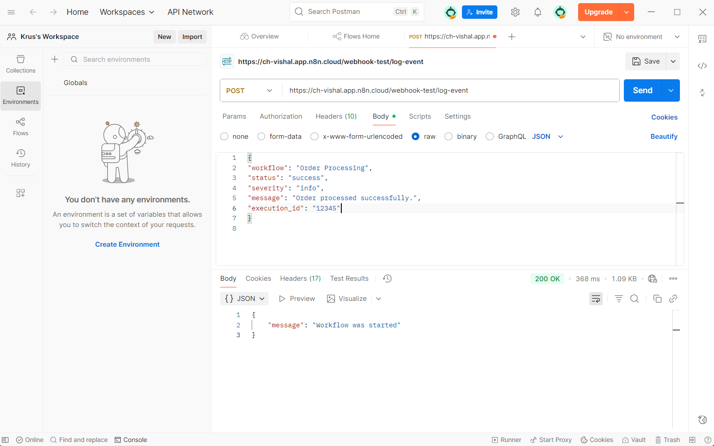

**Optional cURL:**
```bash
curl -X POST "https://<your-n8n-host>/webhook-test/log-event" \
  -H "Content-Type: application/json" \
  -d '{
        "workflow": "Order Processing",
        "status": "success",
        "severity": "info",
        "message": "Order processed successfully.",
        "execution_id": "12345"
      }'
```
**Wire:** Webhook → Set

---

### 2) **Set** — *set data*
- **Drag & Drop:** Set node
- **Operation:** Add/override fields
- **Mode:** Keep as **String**

**Assignments (copy):**
```text
timestamp   = {{$now}}
workflow    = {{$json.workflow || "Order Processing"}}
status      = {{$json.status || "success"}}
severity    = {{$json.severity || ($json.status === "failed" ? "error" : "info")}}
message     = {{$json.message || "Order processed successfully."}}
execution_id= {{$execution.id}}
```
**Wire:** Set → HTTP Request

---

### 3) **HTTP Request** — *elastic search request*
- **Drag & Drop:** HTTP Request node
- **Operation / Mode:** Request → POST
- **URL:** `https://<ELASTIC_ENDPOINT>/n8n-logs/_doc`
- **Headers (Using JSON):**
```json
{
  "Authorization": "ApiKey <paste-ENCODED-KEY>",
  "Content-Type": "application/json"
}
```
- **Body — Correct way**
  - Toggle **JSON/RAW Parameters: ON**
  - **Body Content Type:** JSON
  - **JSON Body:** `={{$json}}`

UI reference for headers/body:  
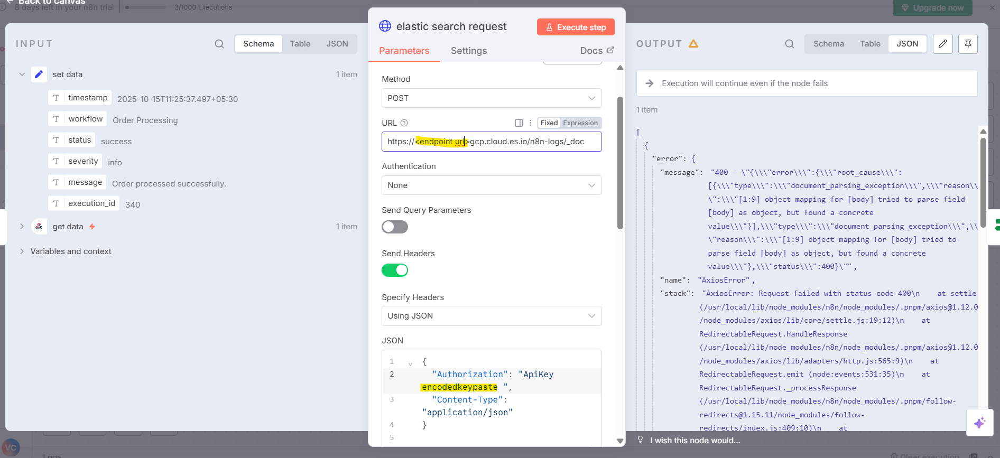

> ❌ **Error way (causes 400 document_parsing_exception):** adding a parameter named `body` with value `={{$json}}` fixed not Expression. That sends `{"body": {...}}` which Elasticsearch rejects.  
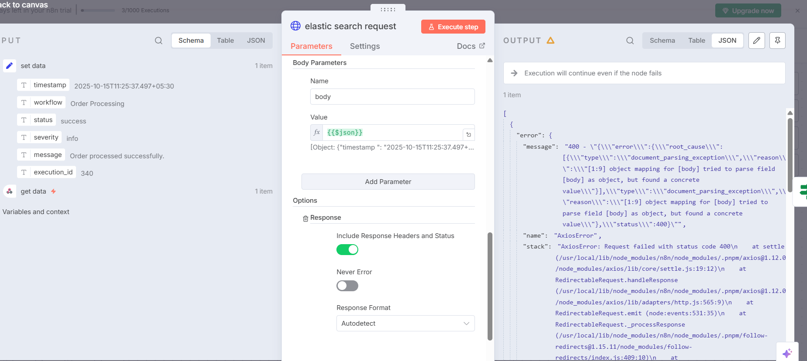

**Options (recommended):**
```text
Response → Include Response Headers and Status: ON
On Error → Continue: (optional ON)
```
**Wire:** HTTP Request → IF

---

### 4) **IF** — *statuscode verifier*
- **Operation / Mode:** All rules must pass

**Rule (copy):**
```text
Left value: ={{$json.statusCode}}
Operation: equals
Right value: 201
```
**Wire:** IF → Success (true), IF → Send a message (false)

---

### 5) **Set** — *Success*
**Assignment:**
```text
logs = {{$json.result}}
```

### 6) **Gmail** — *Send a message*
**Fields (copy):**
```text
To: your-email@company.com
Subject: error in elastic search
Message:
code: {{$json.error.code}}
status code: {{$json.error.status}}
```

---

## C) Kibana Data View (Explore Logs)

Create a Data View once documents arrive:
```text
Stack Management → Kibana → Data Views → Create data view
Name: n8n-logs
Index pattern: n8n-logs*
Time field: timestamp
```

---

## D) Quick Copy Blocks

**Index URL:**
```text
https://<ELASTIC_ENDPOINT>/n8n-logs/_doc
```

**Headers JSON:**
```json
{
  "Authorization": "ApiKey <paste-ENCODED-KEY>",
  "Content-Type": "application/json"
}
```

**JSON Body (n8n):**
```
={{$json}}
```

---

## E) Troubleshooting

- **400 document_parsing_exception** → You sent `{"body": {...}}`. Remove the `body` param; send the document itself as JSON body.
- **401 Unauthorized** → Use the **Encoded** key from Kibana (Base64 of `id:key`).
- **Index not found** → Using `/_doc` auto-creates `n8n-logs` on first write.

---


**You’re done.** Execute your workflow and explore documents in **Kibana → Discover**.
