# First ML Model Predictor — n8n Workflow Guide (Final)

## Prerequisites

### System & Tools
- Windows/macOS/Linux
- Python **3.10–3.12** with **pip** and **venv**
- VS Code (or any editor), Terminal/PowerShell
- Postman or `curl` for testing
- (Optional) ngrok if you need a public webhook URL

### Python Dependencies
Use the provided `requirements.txt`:

## 1) Prepare data.csv

Place your dataset file **`data.csv`** in the same folder as `app.py`. In Colab, upload it to the **Files** pane and reference it as `/content/data.csv`. Locally, reference it as `./data.csv`.
```
!pip install pandas
!pip install sklearn
!pip install joblib
```
```
import pandas as pd
from sklearn.ensemble import RandomForestClassifier
import joblib
```
```
# 1. Load data
df = pd.read_csv("/content/data.csv")
# 2. Split features and target
X = df[["temperature", "vibration", "pressure"]]
y = df["is_failure"]
# 3. Train model
model = RandomForestClassifier(n_estimators=100, random_state=42)
model.fit(X, y)
# 4. Save model
joblib.dump(model, "model.pkl")
```

Screenshots:
- Uploading CSV in Colab:  
  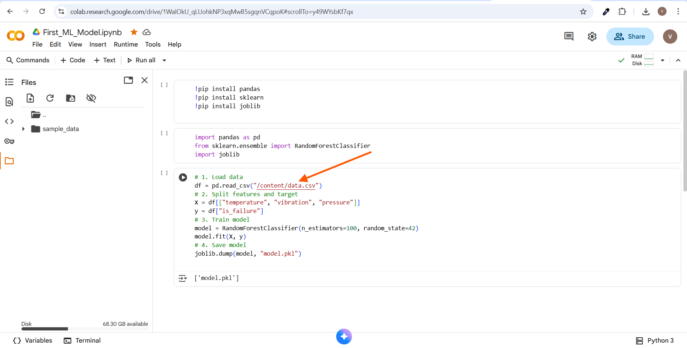
- Another view of CSV in Files pane:  
  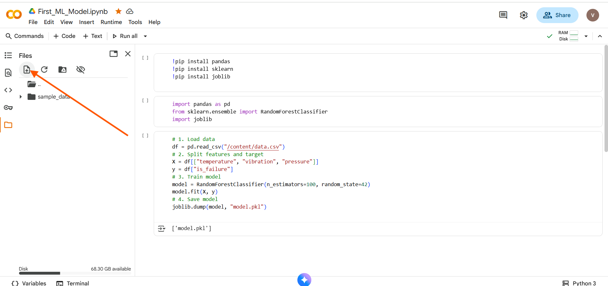
- Calling the CSV in notebook code:  
  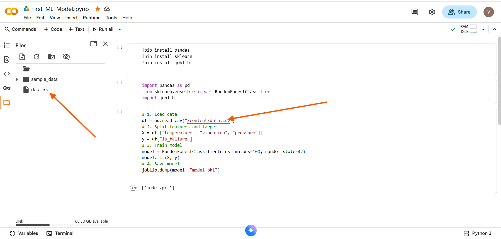
- After training, `model.pkl` appears:  
  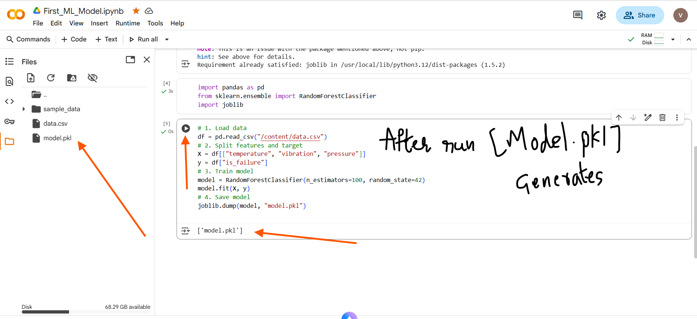

> You can use your own schema; for the provided Flask app, **prediction** requires JSON with `temperature`, `vibration`, `pressure` fields.

---
Download Model folder Open in Vs Code

## 2) Create and activate a virtual environment

Open a terminal in the project folder and run:

```bash
# Windows (PowerShell)
python -m venv .venv
.\.venv\Scripts\Activate.ps1

# macOS/Linux
python3 -m venv .venv
source .venv/bin/activate
```

Screenshots:  
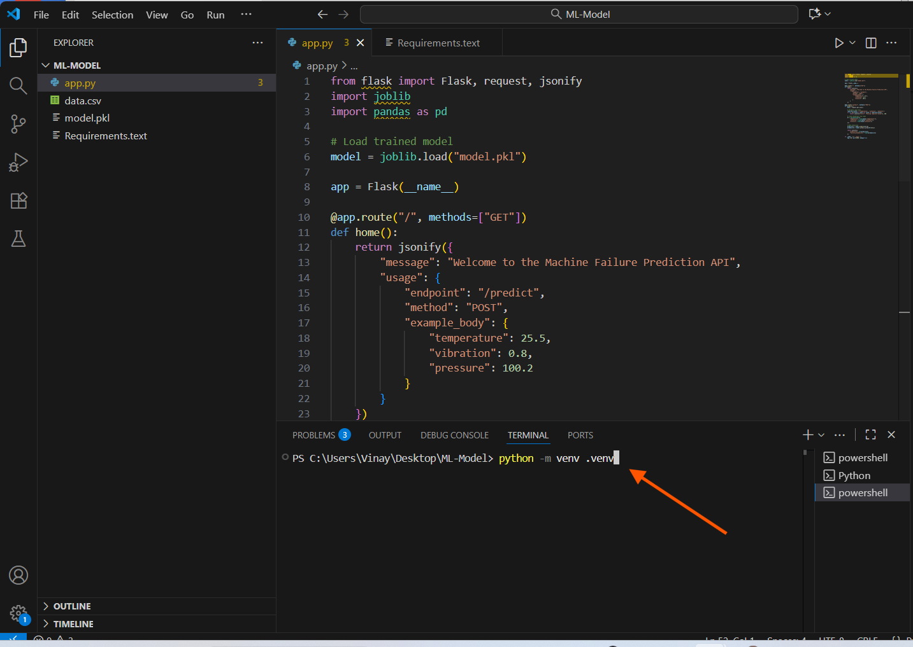

---

## 3) Install dependencies

Ensure `requirements.txt` contains Flask/ML libs, then install:

```bash
pip install -r requirements.txt
```

Screenshots:  
- Paste requirements: 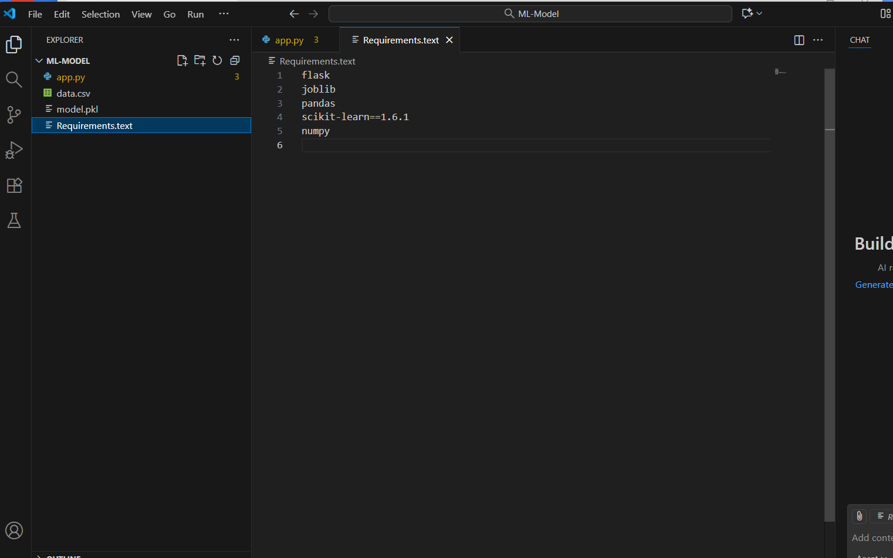  
- Install run: 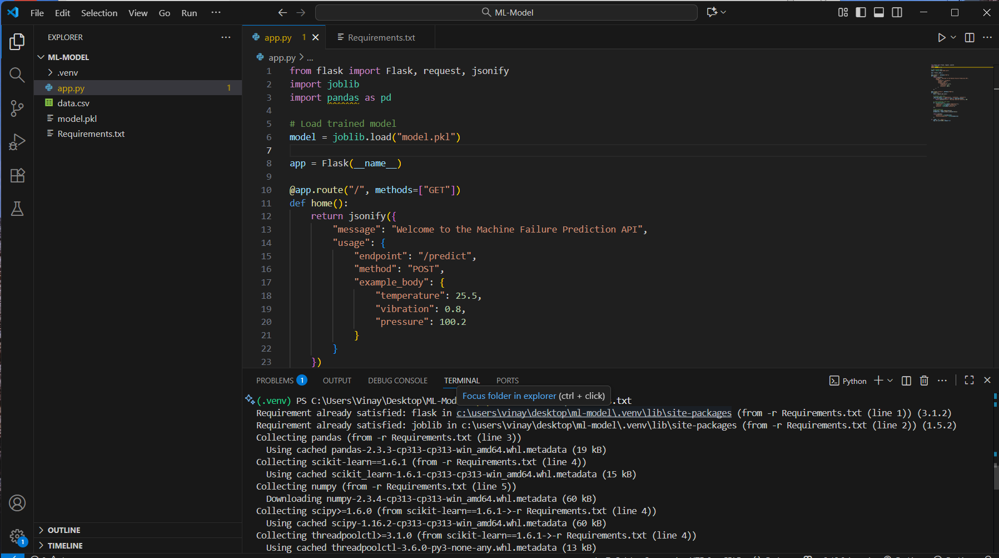  

---

## 4) Start the Flask API

```bash
python app.py
```

You should see it listening on `http://127.0.0.1:5000`.  
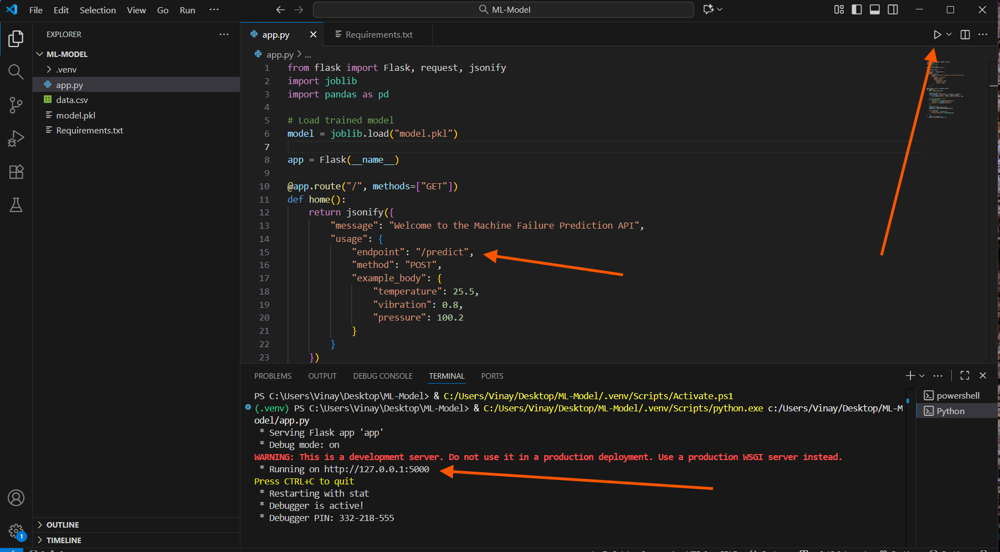

**What the API expects/returns:**  
- POST `/predict` with JSON body: `{"temperature": 50, "vibration": 2, "pressure": 12}`  
- Returns JSON: `{"prediction": <0|1>, "failure_probability": <float>}`

---

## 5) Import the n8n workflow and wire nodes

Import `First-Ml-Model-Predictor.json` in n8n. The canvas looks like this:  
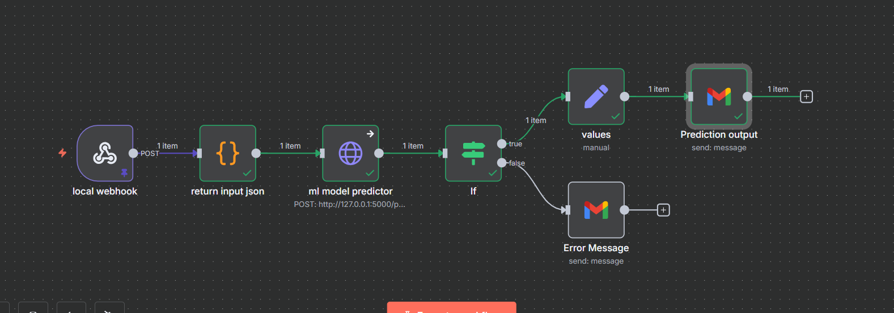

### Node A — Webhook (Trigger)
- **Method:** `POST`
- **Path:** `10010630-850c-4bb9-b0cc-d43c17029abd`
- **Test URL:** `http://localhost:5678/webhook-test/10010630-850c-4bb9-b0cc-d43c17029abd`

Send a test from Postman (or curl):  
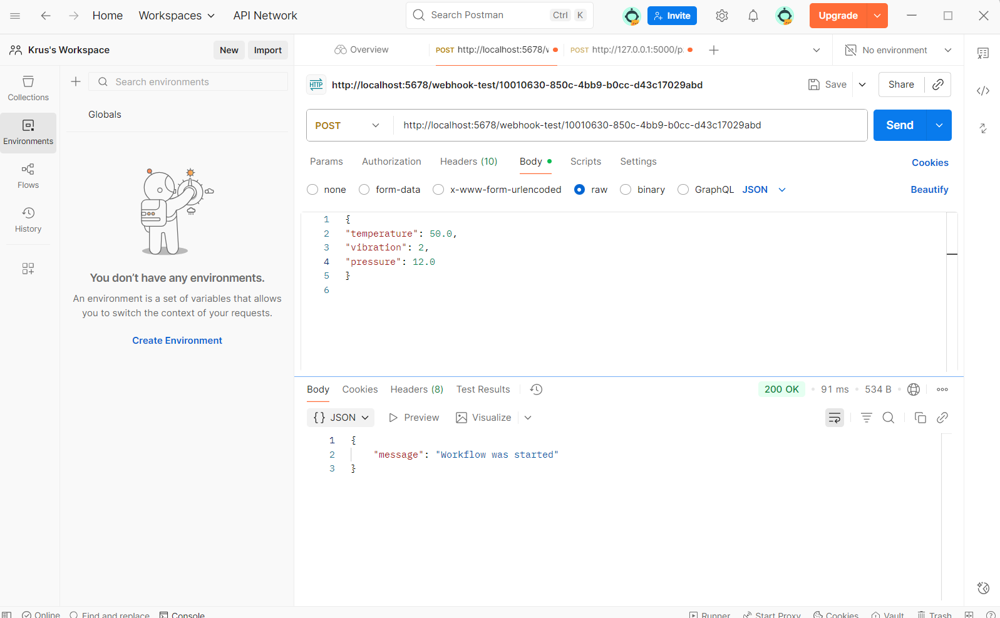

**Sample JSON:**
```json
{
  "temperature": 50,
  "vibration": 2,
  "pressure": 12
}
```

### Node B — Code (return input json)
```js
return [{
  json: {
    temperature: $input.first().json.body.temperature,
    vibration: $input.first().json.body.vibration,
    pressure: $input.first().json.body.pressure
  }
}]
```

### Node C — HTTP Request (ml model predictor)
- **Method:** `POST`
- **URL:** `http://127.0.0.1:5000/predict`
- **Send Body:** JSON → `={{$json}}` For PREDICT keep it expression
- **Error Send Body** JSON → `={"temperature":20}` For PREDICT keep it fixed
- **On Error:** Continue regular output

Preview of configuration/response:  
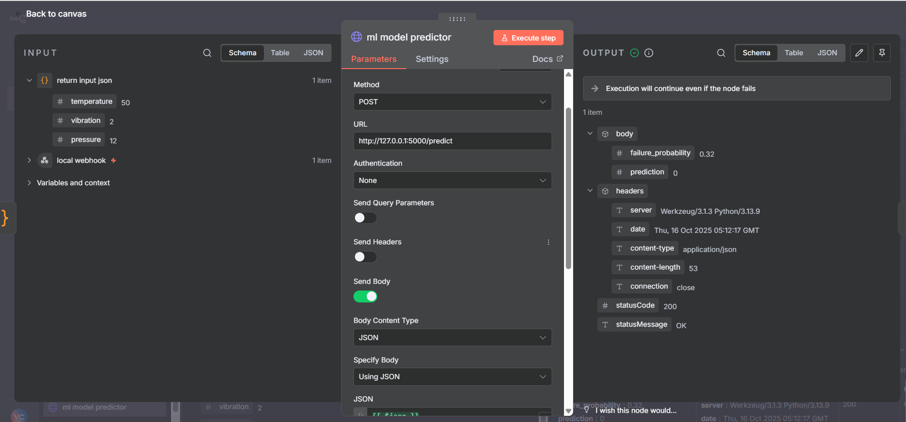

### Node D — IF
- Left: `={$json.statusCode}`  
- Operation: `equals`  
- Right: `200`

### Node E — Set (values)
- `Success` → `={$json.statusCode}`
- `failure_probability` → `={$json.body.failure_probability}`
- `prediction` → `={$json.body.prediction}`

### Node F — Gmail (Prediction output)
```
input:
temperature:{ $('return input json').item.json.temperature }
vibration:{ $('return input json').item.json.vibration }
pressure:{ $('return input json').item.json.pressure }

output:
failure_probability: { $json.failure_probability }
prediction:{ $json.prediction }
```

### Node G — Gmail (Error Message)
```
Status: { $json.error.status }
Code: { $json.error.code }
```

---

## 6) End-to-end test checklist

1. `data.csv` placed correctly and model trained → `model.pkl` available.
2. Virtualenv activated and `pip install -r requirements.txt` completed.
3. Flask running on `http://127.0.0.1:5000`.
4. n8n workflow imported and activated.
5. Send webhook JSON (Postman/curl) and verify:
   - HTTP node shows `statusCode: 200` with prediction fields.
   - Email received with either **Prediction** or **Error in Model**.

---

## Notes

- Prediction payload format is enforced by the Flask app (`temperature`, `vibration`, `pressure`).  
- The n8n HTTP node URL points to the local API by default. Change it to a public URL when you deploy the API.

